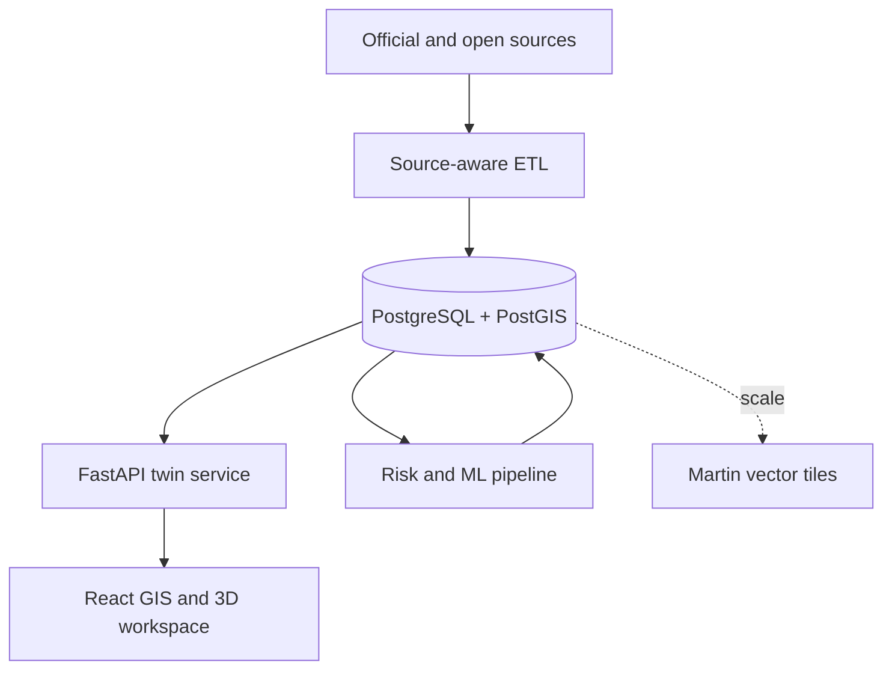

# Architecture

## System boundary

SIMRAS treats the digital twin as the product centre. GIS, observations,
inspections, 3D, alerts and analytics are state contributors for one canonical
physical asset, not disconnected demonstrations.

## Repository decisions

- PostgreSQL/PostGIS is the canonical system of record.
- Large rasters, GLB/GLTF and 3D Tiles belong in object storage; PostGIS keeps
  their metadata, footprints, versions and checksums.
- `/api/v1/assets/{asset_code}/twin` is the aggregate read model for the viewer.
- Three.js/React Three Fiber provides close-up structural interaction.
- CesiumJS provides WGS84 context, terrain and large geospatial 3D.
- Martin is optional until asset/map volume makes raw GeoJSON inefficient.
- Prefect extracts and schedules source jobs. Identity matching remains an
  explicit verification step.

## Trust boundaries

Public users receive read endpoints. Inspection, maintenance, ingestion and
administration writes must require an authenticated administrator and are not
enabled in this first repository slice. API keys in `.env` are development
placeholders, not a substitute for production identity management.

## Twin fidelity

| Level | Meaning |
|---|---|
| L0 | Procedural illustration; never described as the real structure |
| L1 | Asset-specific approximate geometry |
| L2 | Georeferenced geometry based on drawings or measurements |
| L3 | Survey, CAD/BIM or photogrammetry-derived model |
| L4 | Instrumented and dynamically validated twin |

The included seed assets are L0 and `NEEDS_VERIFICATION` by design.

